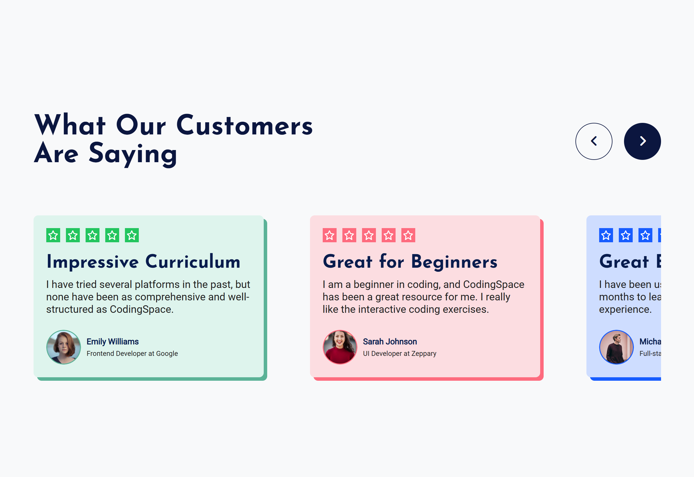

# Testimonials UI Component

This project implements a **Testimonials UI Component** which is a responsive testimonial slider. It features a clean design with customer reviews presented in a carousel-like format. The layout adapts for both desktop and mobile views, ensuring an optimal user experience across devices. This project was built using **HTML**, **CSS (LESS preprocessor)**, and **JavaScript**.

## Demo

You can view the live demo of this project at:  
[Demo Link](https://yashi-singh-9.github.io/Testimonials-UI-Component/)

Screenshot



## Features

- **Responsive Design**: The testimonial slider adjusts for different screen sizes.
- **Carousel Functionality**: Users can navigate through the testimonials using left and right arrows.
- **Modern UI**: The component uses a clean, contemporary design with smooth animations.
- **LESS Preprocessor**: Styles are written using LESS, a CSS preprocessor that adds variables and nesting for a more maintainable codebase.
- **Icons**: Font Awesome icons are used for the star ratings and navigation arrows.

## Technologies Used

- **HTML5**: Markup structure.
- **CSS3**: Styling the component with a focus on responsiveness.
- **LESS**: A preprocessor for enhanced CSS functionality, including variables, mixins, and nested rules.
- **JavaScript**: For adding interactivity to the testimonial slider.
- **Font Awesome**: For star icons and navigation arrows.

## Installation

1. Clone the repository:

    ```bash
    git clone https://github.com/Yashi-Singh-9/Testimonials-UI-Component.git
    ```

2. Open the project directory:

    ```bash
    cd Testimonials-UI-Component
    ```

3. Open the `index.html` file in your browser to see the component in action.

## Project Structure

```
Testimonials-UI-Component/
│
├── index.html          # The main HTML structure of the Testimonials UI
├── style.less          # LESS file containing styles for the testimonials component
├── script.js           # JavaScript file to add interactivity (slider functionality)
└── images/             # Folder containing the images used in the testimonials
    ├── emily.png
    ├── sarah.png
    └── michael.png
```

### HTML
- The `index.html` file contains the structure of the testimonial section and integrates the testimonials, header, and navigation buttons.

### LESS (CSS)
- The `style.less` file contains the styles for the testimonial component, including:
    - Color variables for a modern design.
    - Nesting of selectors for better readability and maintainability.
    - Media queries for responsiveness across different devices.

### JavaScript
- The `script.js` file contains the logic for the testimonial slider:
    - It updates the position of the testimonials based on the index.
    - Event listeners for the left and right buttons allow users to navigate through testimonials.

### Images
- The `images/` folder contains the profile pictures for the authors of the testimonials.

## Responsiveness

This component is designed to work across a variety of screen sizes:
- On larger screens, the testimonials are displayed side by side in a horizontal layout.
- On smaller screens, the testimonials stack vertically, and the slider adjusts to fit smaller screen widths.

The media queries ensure that the layout is fluid and responsive, providing a seamless experience for mobile and tablet users.

## How to Use

1. **Navigation**: Use the left and right arrow buttons to navigate through the testimonials.
2. **Responsive**: Resize your browser window to see how the component adjusts on different screen sizes.
3. **Adding More Testimonials**: You can easily add more testimonials by copying the structure of the existing `.testimonial-card` divs and updating the content.

## Contributing

If you would like to contribute to this project, feel free to fork the repository and submit a pull request. Please ensure that your changes are well-tested and don't break the existing functionality.

## License

This project is open-source and available under the [MIT License](https://opensource.org/licenses/MIT).

---

**Happy coding!** 🚀
